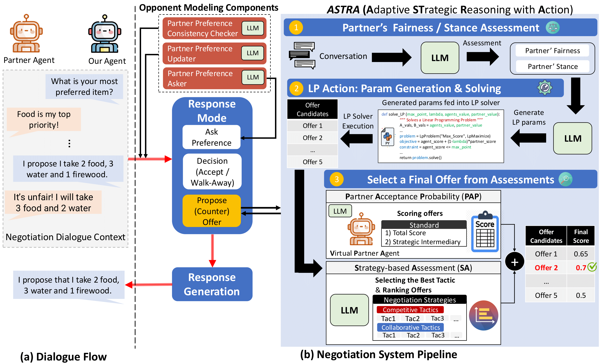

## ASTRA-NegoAgent

- This repository contains the code for a systematic evaluation of Large Language Models (LLMs) in negotiation dialogues. This work has been accepted at **Main conference of EMNLP 2025**.

- Title: [ASTRA: A Negotiation Agent with Adaptive and Strategic Reasoning via Tool-integrated Action for Dynamic Offer Optimization](https://arxiv.org/abs/2503.07129)


- For any queries, please contact the first author: **Brian Deuksin Kwon** (deuksink@usc.edu).

---

## Setup

### Prerequisites
- Python 3.10.16 or higher
- pyenv (recommended for Python version management) + virtualenv

### Environment Setup

- Create a virtual enviroment and install dependices
```
pyenv virtualenv 3.10.16 ASTRA-env
pyenv activate ASTRA-env
pip install -r requirements.txt
```


### API Keys Setup

Set the following environment variables for LLM APIs (replace with your actual API keys):

```bash
export OPENAI_API_KEY="your-openai-api-key"
export ANTHROPIC_API_KEY="your-anthropic-api-key"
export GEMINI_API_KEY="your-google-gemini-api-key"
```

## Running Experiments

### Basic Usage
```bash
python agent_agent_simulation.py --n_exp 1 --n_round 25 -w1 0.35 -w2 0.65 --top_n 5
```

### Advanced Configuration
```bash
# Run with specific engines and negotiation types
python agent_agent_simulation.py \
  --engine-STR gpt-4o-mini \
  --engine-partner gpt-4o-mini \
  --negotiation-type integrative \
  --n_exp 3 \
  --n_round 10
```

### Batch Experiments
```bash
# Run predefined experiment configurations
bash run_a2a_experiment.sh
```

## References
If you use data or code in this repository, please cite our paper:

```bibtex
@misc{kwon2025astranegotiationagentadaptive,
      title={ASTRA: A Negotiation Agent with Adaptive and Strategic Reasoning through Action in Dynamic Offer Optimization},
      author={Deuksin Kwon and Jiwon Hae and Emma Clift and Daniel Shamsoddini and Jonathan Gratch and Gale M. Lucas},
      year={2025},
      eprint={2503.07129},
      archivePrefix={arXiv},
      primaryClass={cs.CL},
      url={https://arxiv.org/abs/2503.07129},
}
```


## LICENSE
Please refer to the LICENSE file in the root directory for more details.

<!--
## Project Structure

- `base_dialog_agent.py` - Core agent class with multi-LLM support
- `async_lib_api.py` - Unified API wrapper with retry logic
- `tools.py` - Linear programming optimization for offer generation
- `priority_consistency_check.py` - Partner behavior validation
- `utils.py` - Common utilities and helper functions
- `run_a2a_experiment.sh` - Experiment configuration script

## Key Parameters

- `--n_exp`: Number of experiment iterations
- `--n_round`: Number of negotiation rounds
- `-w1`, `-w2`: Weighting factors for agent objectives
- `--engine-STR`, `--engine-partner`: LLM engines for each agent
- `--negotiation-type`: "integrative", "distributed", or "mixed" -->
